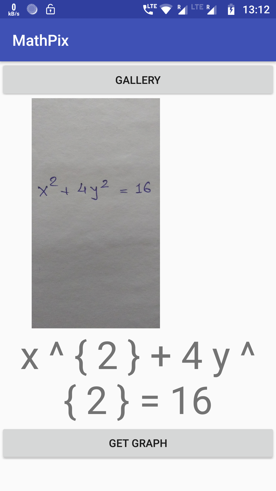
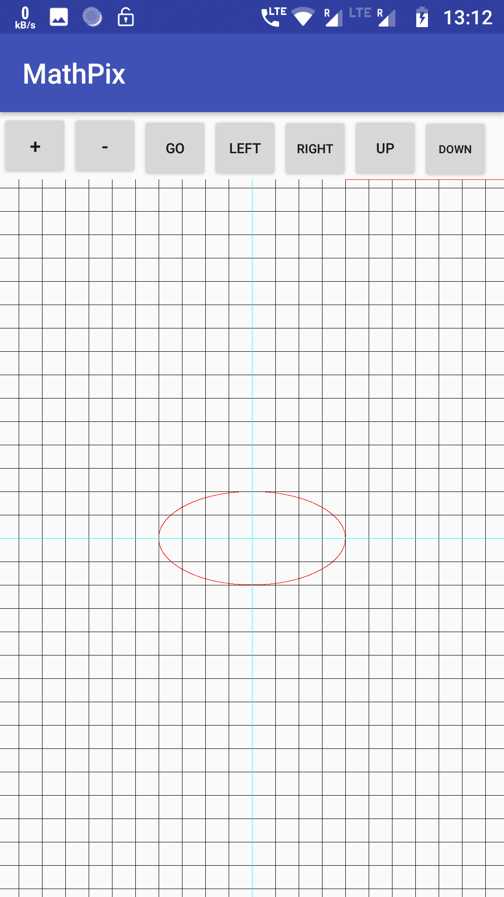

# MathPix

### OCR App that reads Mathematical Equation and Plots Graph

This Application takes and image from the gallery having the mathematical equation written and then calls an online OCR API called MathPix the convet the equation in the image to a string.

 

Once the string has been generated the application seperates out coeffiecient and power of all the variables.

After that it generates the whole equation in form of just one variable and the plots it on the graph

 
